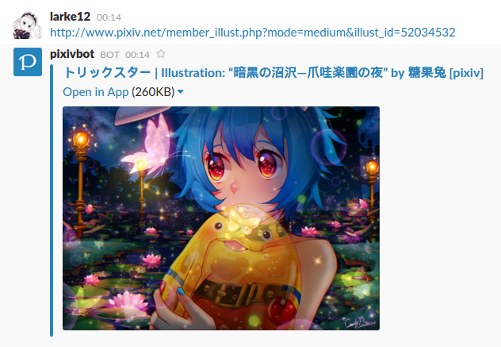

# Pixivbot
This is a Slack bot based on [slack-ruby-bot](https://github.com/dblock/slack-ruby-bot), [slack-mathbot](https://github.com/dblock/slack-mathbot), and inspired by another [Slack Pixiv Bot](https://github.com/castaneai/slack-pixiv-bot).

## Purpose

When a [Pixiv](http://www.pixiv.net/) link is posted in the channel the Pixiv bot is in, it will "unfurl" the image via message attachements. Pixiv does not allow the images on the site to reside in the metadata, so standard Slack unfurling is unable to preview the image.

If you run iOS, the bot will also post an `Open in App` link to view the image in the native Pixiv app. No more mobile web view!

## License

Do what you want. It's a Slack Bot.
